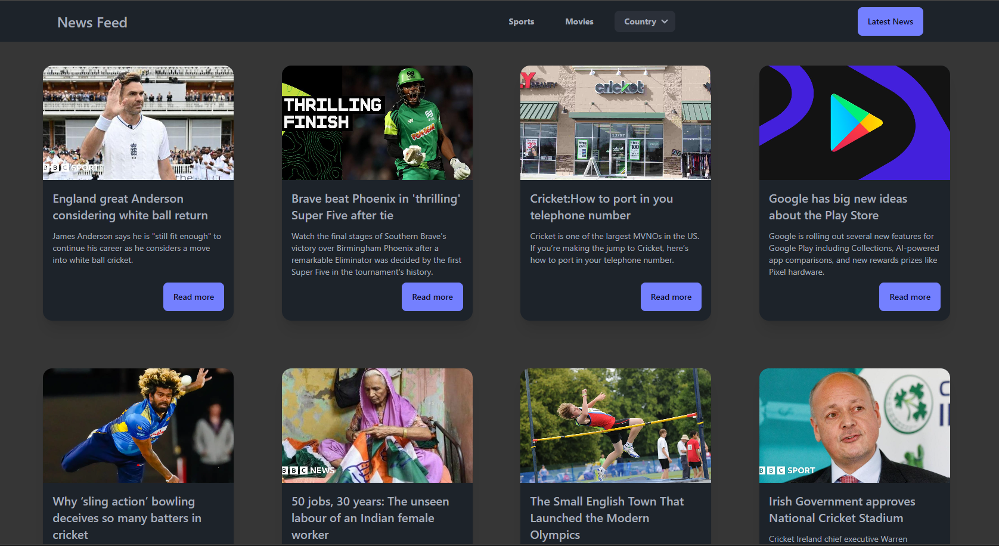

# News App Project 
Get the latest news with our React app. Quickly explore categories like sports, movies, and more with easy-to-use filters.


## Features

- Live News Feed
- Responsive for mobiles
- Filters like Sports, Movies etc
- Loading and Error UI 
- Light/dark mode toggle


## API Reference

#### Get news API

```http
https://newsapi.org/v2/everything?q=tesla&apiKey=API_KEY
```

| Parameter | Type     | Description                |
| :-------- | :------- | :------------------------- |
| `api_key` | `string` | **Required**. Your API key |


## Project images and Video Sample
- Click on image to watch the video
[](https://youtu.be/UNQgXMc3nZg)


## Environment Variables

`VITE_API_KEY`
`VITE_NEWS_API`


## Installation

Install my-project with npm

```bash
  git clone `url`
  npm install 
  npm rundev
```
    
## Contributing
Contributions are always welcome!


How to Contribute
- Fork the repository.
- Create a new branch for your feature or bugfix.
```bash
git checkout -b feature/your-feature-name
```
- Commit your changes:
```bash
git commit -m "Add your commit message here"
```
- Push to your branch:
```bash
git push origin feature/your-feature-name
```

- Open a Pull Request on GitHub.

#### Code Guidelines

    1) Follow coding standards: Ensure consistency in style and structure.
    2) Write clear commit messages: Describe what your changes do.
    3) Add comments for clarity: Explain complex code.
    4) Test your code: Ensure your changes don’t break anything.
    5) Open a pull request: After completing your changes, submit a pull request for review.


